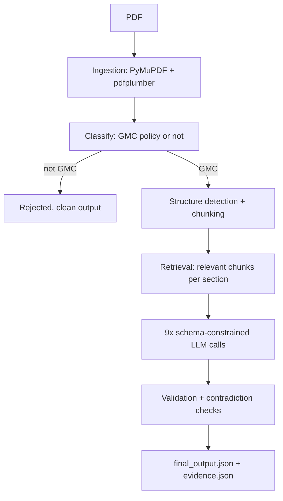

# VeraScope

Turns Group Medical Cover (GMC) insurance policy PDFs — messy, differently
formatted across insurers — into clean structured JSON, with a page-level
citation for every field it pulls out. Built for the AI/LLM Engineering
Intern – Document Intelligence assignment.

**The 30-second version:** PDF in → classify it → pull text and tables →
find the relevant sections → ask an LLM to fill in a validated schema, one
section at a time → sanity-check the result → JSON out, plus a separate
file showing exactly where every value came from.

## Results

| | |
|---|---|
| Accuracy (Groq, 3 real documents, hand-checked ground truth) | **97.5%** (39/40 fields) |
| Cross-checked against a second provider (Gemini, same document) | 92% — one miss, a spelling variant ("Ltd." vs "Limited"), not a real error |
| Tests | 123/123, no API key needed to run them |
| LLM providers supported | Anthropic, OpenAI, Groq, Gemini — one config line to switch |

These are real numbers from real runs, not targets. The first real run
actually scored 70%, with one document at 8% because of a rate-limit bug —
details on that and what fixed it are in [Engineering notes](#engineering-notes-the-interesting-parts).

## Architecture



Each box is a separate module that doesn't know how the others work —
ingestion has no idea an LLM exists, and the extraction stages don't know
or care which LLM provider is configured. That last part is a plain
interface (`LLMClient`) with four interchangeable implementations, so
adding Gemini as a fourth provider later took one new file, no changes to
the pipeline itself.

## Tech stack

PyMuPDF + pdfplumber for parsing · Pydantic v2 for schema and validation ·
Anthropic / OpenAI / Groq / Gemini for extraction · pytesseract + Tesseract
for OCR fallback · pytest.

No vector database or embeddings — the document set is small enough that
heading + keyword retrieval covers it without the extra moving part. Would
revisit that if the document volume grew a lot.

## Running it

```bash
git clone <this-repo>
cd gmc-document-intelligence
make setup                       # venv, deps, copies .env.example -> .env
# add one LLM API key to .env — Groq and Gemini both have free tiers
python run_pipeline.py           # processes everything in data/input/
make test                        # 123 tests, no API key required
```

## What it actually produces

Each document becomes structured fields like insurer name, sum insured
tiers, maternity coverage, waiting periods, room rent limits — about a
dozen categories in total (`src/extraction/schema.py` has the full shape).
Every field is either a fact (`found` + `value`) or a coverage status
(`covered` / `not_covered` / `waived_off` / `not_specified` + limit +
conditions), and every one carries its source evidence. If a field is
ambiguous or missing, it says so — it never guesses.

If the document isn't a GMC policy at all (the sample set includes one
that's actually a Group Personal Accident policy), it gets rejected
cleanly at the classification step instead of being forced through the
wrong schema.

## Engineering notes (the interesting parts)

A few decisions and bugs that were worth solving, briefly:

- **A table was getting duplicated into the same LLM call 2-3 times**,
  because chunking attaches every chunk on a page to all of that page's
  tables, and one document had three chunks sharing one large table. That
  single bug was the reason one document scored 8% instead of ~100% — found
  by actually reading the assembled context the LLM received, not just the
  error message. Fixed by deduplicating tables per context. Full story in
  the code comments at `stage_extractor.py::_build_context()`.
- **Sum Insured tiers kept getting merged into one garbage number** when a
  document listed multiple tiers. A better prompt didn't reliably fix it.
  What did: asking the LLM for each tier as plain text instead of a number,
  then converting it to a number in code afterward — a much easier task for
  a model to get right.
- **Gemini's structured-output mode doesn't support the schema format
  Pydantic generates by default** (no `$defs`/`$ref`). Added a small
  function to flatten the schema before sending it, verified against a real
  API call before trusting it on the full pipeline.
- **Every invalid state is blocked at the schema level, not by convention**
  — you can't construct a field marked "not covered" that also has a
  coverage limit; Pydantic rejects it outright.

## What's not done

- OCR is implemented and tested, but only against a synthetic scanned
  image — there's no real scanned policy in the sample set to test against.
- The keyword lists used for retrieval were broadened using general
  insurance-domain knowledge to hedge against a fourth insurer's different
  phrasing, but that's untested against an actual fourth insurer.
- Evaluation is based on 3 real documents across 2 insurers — enough to
  find and fix real bugs, not enough to claim broad generalization.

Longer version of all of this, including full before/after numbers and the
complete self-review against the assignment brief, is in [`docs/DEEP_DIVE.md`](docs/DEEP_DIVE.md).
