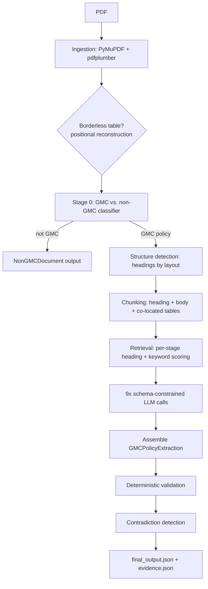

# VeraScope — Deep Dive

This is the long version. The [top-level README](../README.md) is the
30-second read; this is the "how does it actually work, and what really
happened when it was tested" version, for anyone reviewing the engineering
in more depth.

## Table of Contents

- [What This Does](#what-this-does)
- [Architecture](#architecture)
- [Walking Through the Pipeline](#walking-through-the-pipeline)
- [Getting Started](#getting-started)
- [Configuration](#configuration)
- [The Data Model](#the-data-model)
- [Design Decisions Worth Knowing About](#design-decisions-worth-knowing-about)
- [Retrieval, Without Embeddings](#retrieval-without-embeddings)
- [OCR](#ocr)
- [Validation & Guardrails](#validation--guardrails)
- [Evidence & Provenance](#evidence--provenance)
- [Results](#results)
- [Assumptions](#assumptions)
- [What I Know Is Missing](#what-i-know-is-missing)
- [What's Next](#whats-next)
- [Self-Assessment](#self-assessment)

## What This Does

Hand it a GMC policy PDF from any insurer and it will:

1. Check whether it's actually a GMC policy first — a Group Personal
   Accident policy or something else entirely gets rejected cleanly at the
   door, not forced through a schema it doesn't fit.
2. Pull text and tables straight out of the PDF (no OCR unless a page
   genuinely needs it).
3. Work out the document's structure — headings, benefit sections — from
   layout, not from a list of section names one insurer happens to use.
4. Retrieve only the handful of chunks relevant to each of nine extraction
   stages, rather than stuffing the whole document into every prompt.
5. Ask an LLM to fill in a strictly validated schema, one stage at a time.
6. Run deterministic checks and contradiction detection over the result.
7. Write out a clean `final_output.json` for downstream systems, and a
   separate `evidence.json` that says exactly where every value came from.

Development and evaluation used a sample corpus of four documents across
three insurers, including one that's deliberately *not* a GMC policy (see
[Results](#results)). Those PDFs aren't bundled in this repo — they're the
assignment's own sample documents, not this project's to redistribute — so
`data/input/` ships empty; drop your own GMC policy PDFs in there to run
the pipeline.

## Architecture



Underneath the linear flow, the part actually worth calling "architecture"
is how little any one stage knows about the others:

- **Ingestion doesn't know about LLMs.** It hands back a plain
  `IngestedDocument` — pages, text, tables, an OCR flag — regardless of
  what happens to it afterward.
- **Extraction doesn't know which LLM provider is configured.** Every stage
  talks to an `LLMClient` interface (`src/extraction/llm_client.py`); which
  concrete class answers is decided once, by `LLM_PROVIDER` in `.env`, and
  swapping providers never touches the orchestration code:

  ```mermaid
  classDiagram
      class LLMClient {
          <<interface>>
          +extract_structured(system_prompt, user_prompt, schema) dict
      }
      class AnthropicLLMClient
      class OpenAILLMClient
      class GroqLLMClient
      class GeminiLLMClient
      LLMClient <|.. AnthropicLLMClient
      LLMClient <|.. OpenAILLMClient
      LLMClient <|.. GroqLLMClient
      LLMClient <|.. GeminiLLMClient
  ```

- **Validation never mutates data.** Deterministic checks and contradiction
  detection only ever *append* to `processing_notes` — nothing silently
  rewrites a value the LLM produced.
- **The schema does a lot of the enforcement work that would otherwise be
  scattered through the code as `if` statements.** A `ValueField` cannot be
  constructed with `found=True` and `value=None`; a `CoverageField` cannot
  carry a `limit` while marked `not_covered`. These are Pydantic validators,
  not conventions someone has to remember to follow.

Directory layout, if you want to go straight to the code:

```
src/
├── ingestion/       PDF → text/tables (PyMuPDF, pdfplumber, positional fallback, OCR)
├── classification/  GMC vs. non-GMC gate
├── preprocessing/   structure detection, chunking, text cleaning, normalization
├── retrieval/       per-stage chunk selection
├── extraction/       schema, prompts, the 4 LLM clients, orchestration
├── validation/       deterministic checks + contradiction detection
└── evaluation/       accuracy scoring against hand-checked ground truth
```

## Walking Through the Pipeline

**Ingestion** (`src/ingestion/`) reads native text and tables with PyMuPDF
and pdfplumber. If a page's table has no visible borders, pdfplumber finds
nothing and PyMuPDF's plain-text reading order scrambles labels and values
into separate blocks — this actually happened on one sample document, and
`positional_table_reconstruction.py` exists specifically to reconstruct
rows from raw text coordinates when that happens. If a page doesn't have
enough native text to be usable, it gets rasterized and OCR'd — but every
sample document here is text-native, so that path never fires on the
included corpus (more on that under [OCR](#ocr)).

**Classification** (`src/classification/document_type.py`) is a deliberately
boring keyword-and-structure check: does this look like a GMC policy, a
Group Personal Accident policy, or neither? Getting this wrong at the start
would be worse than getting anything downstream wrong, so it's the very
first gate, not a background check.

**Structure detection** (`src/preprocessing/structure_detection.py`) finds
headings using a layout rule, not a list of known section titles: a line is
a heading if it isn't itself a numbered item and the *next* non-blank line
starts a numbered list beginning at `1`. That "restart at 1" condition
exists because of a real bug — wrapped continuation lines followed by an
*incremented* number (an existing list continuing, not a new one) were
being misread as headings.

**Chunking** (`src/preprocessing/chunking.py`) groups each heading with its
body text and whichever tables share its page.

**Retrieval** (`src/retrieval/`) picks, per extraction stage, which chunks
actually get sent to the LLM — see [Retrieval, Without Embeddings](#retrieval-without-embeddings)
for why this isn't a vector search.

**Extraction** (`src/extraction/`) runs nine LLM calls, each scoped to its
own retrieved chunks and constrained to return exactly the shape of one
Pydantic sub-schema.

**Validation** (`src/validation/`) runs deterministic sanity checks and
looks for a field's own evidence snippets contradicting each other.

**Serialization** (`src/extraction/serialization.py`) splits the one
in-memory result into the two output files, from a single pass, so they
can never drift apart.

## Getting Started

Requires Python 3.11+.

```bash
git clone <this-repo>
cd gmc-document-intelligence
make setup      # creates .venv, installs pinned deps, copies .env.example -> .env
```

`make setup` builds an isolated virtual environment rather than installing
into system Python. That's not just tidiness — modern Debian/Ubuntu (PEP
668) will flatly refuse a plain `pip install` outside a venv, which is a
failure this project's own setup ran into and fixed, not a hypothetical.

OCR needs the actual Tesseract engine as a system binary — `pytesseract` is
just a thin wrapper around it:

```bash
# Windows (winget)
winget install --id UB-Mannheim.TesseractOCR -e
# Debian/Ubuntu
sudo apt-get install tesseract-ocr
# macOS
brew install tesseract
```

If `tesseract` isn't on PATH, `src/ingestion/ocr_fallback.py` falls back to
the default Windows install path
(`C:\Program Files\Tesseract-OCR\tesseract.exe`); a package-manager install
on Linux/Mac puts it on PATH automatically. None of the sample documents
are scanned, so this only matters if you bring your own.

```bash
source .venv/bin/activate
python run_pipeline.py                       # processes every PDF in data/input/
python run_pipeline.py --input data/input --output data/output
make test                                     # run all 123 tests
python -m src.evaluation.metrics              # compare output vs. ground truth
```

**In VS Code:** open the folder, select the `.venv` interpreter (it should
be picked up automatically), and use the Testing sidebar or the provided
launch configurations (`Run Pipeline`, `Run Evaluation`, `Debug Current Test
File`).

## Configuration

Copy `.env.example` to `.env` and fill in one provider:

```bash
LLM_PROVIDER=anthropic          # or "openai" / "groq" / "gemini"
ANTHROPIC_API_KEY=sk-...        # required if LLM_PROVIDER=anthropic
OPENAI_API_KEY=sk-...           # required if LLM_PROVIDER=openai
GROQ_API_KEY=gsk_...            # required if LLM_PROVIDER=groq
GEMINI_API_KEY=AQ....           # required if LLM_PROVIDER=gemini
ANTHROPIC_MODEL=                # optional override, defaults to a current Sonnet snapshot
OPENAI_MODEL=                   # optional override, defaults to gpt-4.1
GROQ_MODEL=                     # optional override, defaults to openai/gpt-oss-120b
GEMINI_MODEL=                   # optional override, defaults to gemini-flash-latest
```

If you don't want to pay for an API key: Anthropic and OpenAI both now
require billing on file before they'll issue one. Groq and Gemini don't —
both have a genuine no-card free tier, which is why they're in here at all.
Both are wired up as `openai`-SDK clients pointed at the provider's own
OpenAI-compatible endpoint rather than a bespoke HTTP client — Groq at
`api.groq.com/openai/v1`, Gemini at
`generativelanguage.googleapis.com/v1beta/openai/`.

Gemini needed one thing Groq didn't: its structured-output mode only
supports a subset of JSON Schema that excludes `$defs`/`$ref`, but
Pydantic always emits nested models that way. `gemini_client.py::inline_refs()`
walks the schema and resolves every reference before it's sent — checked
against a real Gemini call with a nested schema before it was trusted on
the full pipeline, not assumed to work from reading the docs alone.

Leave `LLM_PROVIDER` or the matching key unset and `run_pipeline.py` tells
you exactly what's missing instead of dying with a raw SDK stack trace.

## The Data Model

```
GMCPolicyExtraction
├── document_metadata          filename, classified type + confidence, page count
├── insurer_and_tpa
├── previous_policy            dates, tenure, premium
├── policy_structure           family structure text, Sum Insured tiers
├── demographics                totals + optional granular breakdown
├── hospitalization             room rent limits, pre/post-hospitalization days
├── maternity                    incl. vaccination cover, optional metro/non-metro splits
├── waiting_periods
├── other_benefits
├── infertility_and_ambulance
├── buffer_and_waivers            + disease-wise capping list
└── processing_notes             validation issues, contradictions, fallbacks — a paper trail
```

Two field types (`src/extraction/field_types.py`) carry every leaf value:

- **`ValueField`** — a plain fact: `value`, `found`, `evidence`. You cannot
  construct one with `found=True` and `value=None`, or the reverse — a
  validator rejects it outright.
- **`CoverageField`** — a benefit: `status` (`covered` / `not_covered` /
  `waived_off` / `not_specified`), plus `limit`, `conditions`, `evidence`.
  A validator refuses a `limit` on anything marked `not_covered` or
  `not_specified`, since a limit only makes sense if something is at least
  partly covered.

If a document turns out not to be GMC, the pipeline returns a
`NonGMCDocument` — metadata plus a reason — instead of forcing empty values
through the GMC schema just to have something to return.

## Design Decisions Worth Knowing About

**Structured output, always, never free-text parsing.** Anthropic gets
forced tool-use; OpenAI, Groq, and Gemini get `response_format` with a
strict JSON schema. The same Pydantic-generated schema feeds all four, but
OpenAI's strict mode is pickier than plain JSON Schema — every object has
to list *all* its properties as required and set
`additionalProperties: false`, recursively, and it rejects the `default`
keyword outright. `_make_strict()` in `openai_client.py` adapts a copy of
the schema for that; Groq reuses it as-is since it's the same requirement.

**`policy_structure` and `demographics` share one LLM call.** Both come
from the same section of every sample document, so splitting them into two
calls would double the cost for nothing.

**Sum Insured tiers are extracted as text, not numbers — on purpose, after
getting burned.** A real run against a "graded" SI table (two tiers, ₹3
lakh and ₹5 lakh, each followed by a repeated Room Rent/ICU block)
produced one garbage concatenated number instead of a two-item list. The
first fix — a clearer prompt with a worked example — looked like it worked,
then failed a retest, merging three numbers instead of two. The fix that
actually held was structural: the LLM is now asked for each tier as a raw
string, exactly as written, and a separate deterministic function
(`finalize_policy_structure()`) converts each one to a number afterward,
reusing the already-tested currency parser. Copying text into list slots is
a much easier task for a model than doing arithmetic on it — this changes
*what the model is asked to do*, not just how nicely it's asked.

**Maternity delivery limits carry optional metro/non-metro fields.** All
three sample insurers state one flat limit, so the plain field covers them;
the split exists for the insurer that eventually doesn't, without forcing
every document through a distinction it doesn't make.

## Retrieval, Without Embeddings

No vector database, no embedding model — retrieval is heading-and-keyword
matching, and it's a deliberate call, not a shortcut. Four rules, tried in
order (`src/retrieval/`):

1. **Canonical heading match.** Does a chunk's detected heading match the
   stage's known section names?
2. **Always include page one**, for the metadata stages — letterhead and
   schedule content lives there across every insurer in the sample set.
3. **Keyword overlap**, up to three extra chunks, for content structure
   detection missed a heading for. This genuinely happens — see
   [What I Know Is Missing](#what-i-know-is-missing).
4. **Last resort: the whole document.** If none of the above find
   anything at all, the stage gets every chunk rather than never reaching
   the LLM. This was meant as insurance against some future unfamiliar
   insurer — checking it against the *existing* sample set instead found
   it firing today: `1_Policy_Copy.pdf`'s buffer-and-waivers stage had
   always retrieved zero chunks and silently defaulted to `not_specified`
   without the LLM ever seeing the document. It now gets the full
   four-page document instead. A real gap, closed on data already in hand.

Each stage's keyword list is also broader than what the three sample
insurers' exact phrasing needed — "cashless," "network hospital," "cooling
period," "moratorium," and similar terms are in there as a hedge against a
fourth insurer phrasing the same benefit differently. Keywords only decide
*which* chunks get retrieved, never what value gets extracted, so widening
this list can only help or do nothing — checked against all three real
documents to confirm it changed nothing there before being kept.

The one bug in this area that actually mattered: `_build_context()`
(`src/extraction/stage_extractor.py`) was rendering a page's tables once
*per chunk* on that page, because chunking deliberately attaches every
chunk on a page to all of that page's tables. On one sample document, a
single page produced three chunks sharing one ~5,000-character table — so
that table got sent to the LLM two or three times in the same call, for
every stage that touched it. Deduplicating on `(page_number, table_index)`
cut per-stage context size by roughly 40-66% on that document and took a
document that had been scoring **8%** (rate-limited into oblivion) up to
**100%**. This is the single highest-leverage bug found in the whole
project, and it was only visible by actually inspecting a live document's
assembled context — the error logs alone just said "rate limited."

## OCR

Not needed anywhere in the sample corpus — every document is fully
text-native, confirmed via a character-density check per page — so it
never fires on the documents included here, and never costs anything on
them either.

It's still implemented for the case where it *is* needed:
`src/ingestion/ocr_fallback.py` rasterizes a specific low-text page with
PyMuPDF (already a dependency) and runs it through Tesseract. Only the
pages that actually need it get re-OCR'd, not the whole document, and
OCR's output only replaces native text if it's genuinely longer than what
native extraction already found — so a bad OCR pass can't make a page
worse than doing nothing.

Being straight about the gap: there is no real scanned GMC policy anywhere
in this project's sample set, so this path is verified with a synthetic
test — a clean, rendered-text image dropped into a PDF with no text layer.
That proves the wiring works end to end. It says nothing about accuracy
against an actual scan, where skew, low resolution, stamps overlapping
text, and multi-column layouts are all real problems a clean synthetic
image can't exercise. It also only recovers prose — a scanned page's
tables aren't reconstructed by this fallback.

## Validation & Guardrails

Deterministic checks (`src/validation/deterministic_checks.py`) run after
every extraction and never silently fix anything — they only add to
`processing_notes`:

- Policy end date after start date.
- Demographic totals internally consistent, when enough granular data
  exists to check (usually a no-op on these documents — see
  [What I Know Is Missing](#what-i-know-is-missing)).
- Sum Insured tiers are positive and plausible (anything above ₹10 crore
  per tier gets flagged, a direct response to the concatenation bug above).
- Which required fields came back empty, for visibility, not as a hard
  failure.

Contradiction detection (`src/validation/contradiction_detection.py`)
checks whether a field's *own* evidence snippets disagree with each other
numerically, and flags it rather than picking a winner. It doesn't
cross-reference against annexures or endorsements — most of the sample set
doesn't include those documents, so there's honestly nothing to
cross-reference against yet.

## Evidence & Provenance

Every field carries its own evidence internally — page number plus the
verbatim snippet it came from. Two files come out of one in-memory result,
in a single pass (`src/extraction/serialization.py`):

- `<doc>.final_output.json` — clean, no evidence, for downstream systems.
- `<doc>.evidence.json` — evidence only, keyed by field path, for anyone
  who wants to check the model's work.

Deriving both from the same object in one pass is what guarantees they
can't quietly drift apart from each other.

## Results

The ground truth (`src/evaluation/ground_truth.json`) was hand-checked
directly against the source PDFs during development, before any LLM key
was available — so the first version of this section had no real numbers
in it at all. Once a Groq key showed up, that changed:

| Document | Fields matched | Accuracy |
|---|---|---|
| GHI_Policy.pdf (Care Health) | 15/16 | 94% |
| 1_Policy_Copy.pdf (Care Health) | 12/12 | 100% |
| Niva Bupa renewal document | 12/12 | 100% |
| **Total** | **39/40** | **97.5%** |

Both non-GMC sample documents were also correctly rejected at the
classification gate in this same run — not in the table above, since the
ground truth only scores GMC-classified fields.

**That 97.5% is the second real run, not the first.** The first one scored
70% (28/40), with the Niva Bupa document alone sitting at 8% — almost every
stage rate-limited into a fallback default. Rather than write that number
down and move on, the actual failing requests got inspected, not just the
error message, and the real cause turned out to be the table-duplication
bug described under [Retrieval](#retrieval-without-embeddings): one
document's LLM calls were carrying 2-3x the context they needed to. Fixing
that — plus adding an explicit `max_tokens` cap that Anthropic already had
and OpenAI/Groq didn't — took that same document from 8% to 100% on a
clean re-run, with the "payload too large" errors that had killed 6-8 of 9
stages dropping to zero.

The `data/output/*.json` files reflect the most recent run of each
individual document against current code, not one synchronized batch run —
re-running everything together risked burning through a shared daily token
quota for no accuracy benefit, so the mix is disclosed here rather than
hidden by forcing a uniform-looking re-run.

**The one remaining miss**, on GHI_Policy.pdf, is "Care Health Insurance
**Limited**" against ground truth's "**Ltd.**" — same insurer, a
legal-suffix spelling difference, not a real extraction error. The
evaluation harness does exact string matching, so it counts as a miss
regardless; worth saying plainly rather than letting 94% imply a mistake
that isn't really there.

**A cross-provider sanity check, since the pipeline shouldn't be secretly
tuned to one model's quirks:** the same `1_Policy_Copy.pdf` that scored
100% on Groq was also run through **Gemini** (`gemini-flash-latest`, an
isolated single-document run, not written into the official output
folder):

| Provider / model | Fields matched | Accuracy |
|---|---|---|
| Groq (`openai/gpt-oss-120b`) | 12/12 | 100% |
| Gemini (`gemini-flash-latest`) | 11/12 | 92% |

Gemini's one miss is the exact same failure class as Groq's: "Care Health
Insurance Limited" vs. "Ltd." Seeing it recur on a different document under
a completely different model is decent evidence this is a scoring-harness
artifact, not something either model got wrong. Two things from this run
are worth flagging honestly rather than smoothing over: Gemini's free tier
enforces a tight five-requests-per-minute quota (hit mid-run, recovered by
the SDK's own retry logic), and one stage returned malformed JSON on the
first attempt — the same non-deterministic strict-mode hiccup already seen
on Groq, absorbed by the same per-stage fallback. This is one real data
point, not a full evaluation — Gemini isn't being promoted to the default
provider on the strength of a single document.

**Also worth knowing:** Groq's `strict: true` mode occasionally still
returns malformed JSON despite Groq's own documentation saying it won't — a
real 400 error on `GHI_Policy.pdf`'s `waiting_periods` stage from one
spurious extra closing brace, absorbed cleanly by the per-stage fallback,
gone on a retry of the same document. It's a real, non-deterministic risk
with this provider, not eliminated, just handled.

What's verified independent of any LLM run at all:

- The full non-GMC path — ingestion through to output — runs correctly
  end to end.
- Every deterministic component — ingestion, structure detection,
  chunking, retrieval, normalization, validation, contradiction detection,
  schema validators, serialization, and the LLM-orchestration logic itself
  via a fake client — is unit-tested: **123/123 passing**.

## Assumptions

- No sample document has a TPA distinct from the insurer, so
  `tpa_name.found = false` is the correct answer for all four, not a gap.
- Granular demographic breakdown (employees, spouses, children, parents)
  usually lives in a separate annexure member list this project doesn't
  have for most sample documents — those fields report `not_found` rather
  than guessing a split from a total.
- Dates in these documents are DD-MM-YYYY or DD-Mon-YYYY, never
  MM-DD-YYYY — date parsing assumes day-first accordingly.

## What I Know Is Missing

- **Structure detection misses headings with no following numbered list**
  — a prose-only paragraph heading, for instance. Content is still
  reachable through keyword retrieval, checked during development, so this
  is a known coarsening rather than silent data loss.
- **One sample document's main benefit table had no visible borders**,
  which made pdfplumber find nothing and scrambled PyMuPDF's plain-text
  reading order into separate label and value blocks. A coordinate-based
  row-reconstruction fallback exists specifically because of this document
  — see `src/ingestion/positional_table_reconstruction.py`.
- **Evaluation only has one sample per insurer for two of the three
  insurers** — only Care Health has two policyholders in the sample set.
  Claims about generalizing across templates rest on the methodology, not
  on a large sample.
- **The retrieval and classification keyword lists were broadened using
  general domain knowledge of Indian GMC/GPA terminology, not validated
  against a real fourth insurer** — none was available. Checked to confirm
  it changes nothing on the three real documents and can only ever expand
  what gets retrieved, never restrict it, so the downside is bounded even
  though the upside is unproven.
- **OCR is wired up but genuinely unverified against a real scan** — see
  [OCR](#ocr) for exactly what was and wasn't tested.
- **This Groq account has a 200,000-token/day cap shared across all
  testing**, separate from the per-minute limit discussed above. Repeated
  development runs against the same documents on the same day eat into
  that budget fast — a couple of stage failures during verification were
  purely the day's quota running low, not a request being too large.

## What's Next

- Run the Sum Insured tier fix against a document with a genuinely
  different graded-tier layout — three-plus tiers, or tiers not sitting
  next to a repeated sub-block — once one is available. The current fix
  is verified against the one real case that broke it, not a general
  guarantee.
- Validate the broadened keyword lists and the retrieval last-resort
  fallback against a real fourth insurer's document, rather than general
  domain knowledge plus the existing three-insurer set.
- Test OCR against an actual scanned document.
- If document volume grows a lot, revisit whether keyword-based retrieval
  still holds up or whether embeddings start earning their complexity —
  not before there's a real reason to.
- Extend contradiction detection to actually cross-reference
  schedule/clause/annexure sources once annexure documents exist to
  cross-reference against.

## Self-Assessment

Honest self-grading against what this kind of assignment usually cares
about:

**Correctness.** Every deterministic stage is tested against real content
pulled from the sample PDFs, not synthetic fixtures alone. The
LLM-orchestration logic is additionally tested with a fake client covering
success, failure, and invalid-output paths — and the full pipeline has
since been run against a real LLM many times over, which surfaced four real
bugs the fake-client tests hadn't: a crash in one stage's fallback path
from a missing default factory, the table-duplication bug that dominated a
real rate-limit failure, and the two-part Sum Insured tier bug
(concatenation, then a duplication issue the first fix itself introduced).
All four are fixed and verified with actual before/after output, not just
marked done.

**Generalization.** Structure detection and retrieval were checked against
three genuinely different insurer layouts — one numbered-list style, one
grid-table style, and correct rejection of a document that isn't GMC at
all. Keyword lists were broadened against general domain terminology as a
hedge for a document this project hasn't seen, honestly flagged as
unverified against a real one. The retrieval last-resort fallback and OCR
were both added for the same reason and both turned out to matter on real
data already in hand, not just a hypothetical future case.

**Engineering.** Modular by responsibility, pinned dependencies, a
reproducible `.venv` setup that caught and fixed a real PEP 668 failure
during its own development rather than assuming one away.

**Reliability.** Every LLM stage fails gracefully — a schema validation
error or an API error degrades that one stage to safe defaults, it doesn't
take down the other eight. Every missing or ambiguous field says so
honestly instead of guessing.

**LLM usage.** Structured output only, across all four providers — never
free-text parsing. Retrieval scopes context per stage instead of one
whole-document prompt.

**Hallucination prevention.** Several invalid states are impossible to
construct at the schema level, not just discouraged by convention.
Contradiction detection flags disagreement between a field's own evidence
rather than silently resolving it. Normalization functions return nothing
on unparseable input instead of guessing at a value.

**Reproducibility.** `make setup && make test` verified from a genuinely
clean machine state, nothing pre-installed.

**Security.** `.env` is git-ignored, no key is hardcoded anywhere, and
`.env.example` ships with empty placeholders only.

**Cost.** Retrieval keeps each of the nine LLM calls scoped to a handful of
relevant chunks instead of the full document, and two stages that draw from
the same section are combined into one call.
